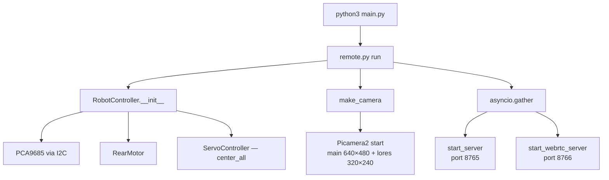
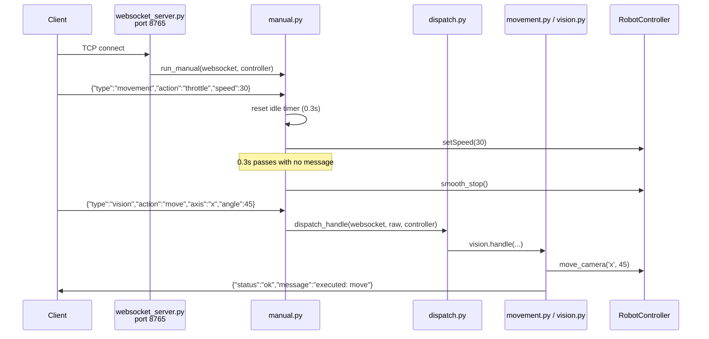
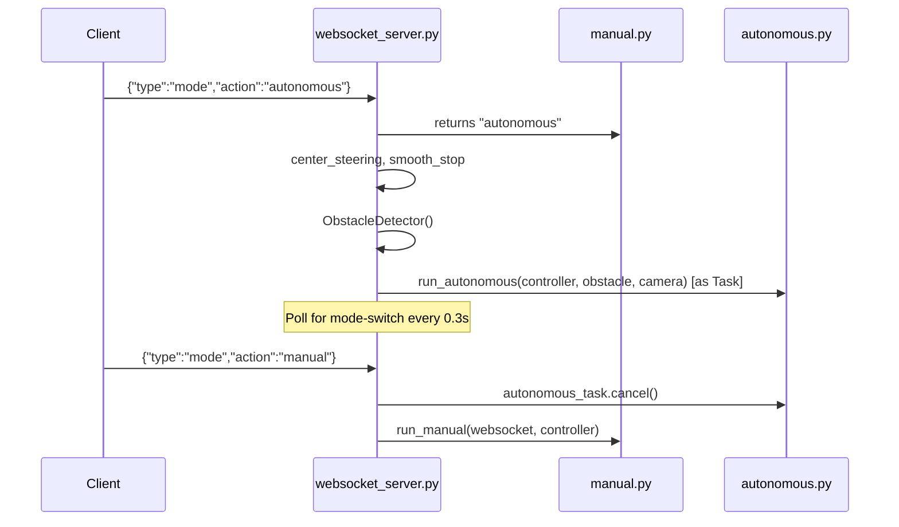
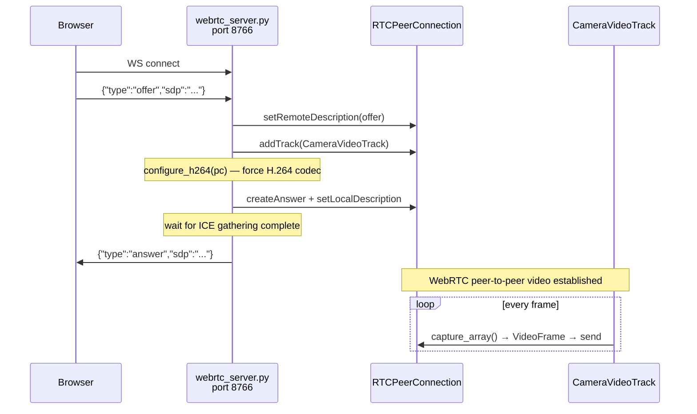

# System Architecture

**robo-pi** — Adeept PiCar-B Mars Rover running on Raspberry Pi 5.

---

## 1. Physical Hardware

```
┌─────────────────────────────────────────────────────────────────┐
│                        Raspberry Pi 5                           │
│                                                                 │
│  I2C Bus ─────────────────────────────────────────────────────  │
│  │                                                              │
│  ├── PCA9685 PWM (0x5f)   ──┬── ch 15/14  →  Rear DC motor      │
│  │                          ├── ch 0      →  Servo 0 (steering) │
│  │                          ├── ch 1      →  Servo 1 (head L/R) │
│  │                          └── ch 2      →  Servo 2 (head U/D) │
│  │                                                              │
│  └── ADS7830 ADC   (0x48)  ──── light sensors / battery voltage │
│                                                                 │
│  GPIO ───────────────────────────────────────────────────────── │
│  ├── GPIO 23/24  →  Ultrasonic HC-SR04 (trigger / echo)         │
│  ├── GPIO 22/27/17  →  Line tracking sensors (L / M / R)        │
│  ├── GPIO 18     →  Buzzer                                      │
│  └── GPIO 12     →  WS2812 NeoPixel LED strip                   │
│                                                                 │
│  CSI ────────────────────────────────────────────────────────── │
│  └── Camera Module  →  Picamera2 (640×480 main + 320×240 lores) │
└─────────────────────────────────────────────────────────────────┘
```

---

## 2. Software Layers

```
┌────────────────────────────────────────────────────────────────┐
│                          main.py                               │  ← entry point
└──────────────────────────────┬─────────────────────────────────┘
                               │
┌──────────────────────────────▼─────────────────────────────────┐
│                     src/core/modes/                            │  ← operating mode
│          remote.py          │         (autonomous path         │
│                             │          wired via websocket)    │
└──────┬──────────────────────┴──────────────────────────────────┘
       │
       ├─────────────────────────┬─────────────────────────────┐
       │                         │                             │
┌──────▼──────┐        ┌─────────▼────────┐         ┌──────────▼──────┐
│  src/comms/ │        │  src/perception/ │         │ src/navigation/ │  ← domain logic
└──────┬──────┘        └─────────┬────────┘         └──────────┬──────┘
       │                         │                             │
       └─────────────────────────┴─────────────────────────────┘
                                 │
┌────────────────────────────────▼───────────────────────────────┐
│                       src/hardware/                            │  ← hardware drivers
│         motors.py   servos.py   sensors/ultrasonic.py          │
└────────────────────────────────────────────────────────────────┘
                                 │
                     ────────────▼───────────
                        Physical Hardware
                     ───────────────────────
```

---

## 3. Module Map

```
src/
│
├── core/
│   ├── config.py               loads hardware.yaml + modes.yaml once; all other modules import from here
│   └── modes/
│       ├── remote.py           entry point for remote mode — owns camera, starts both servers
│       ├── manual.py           WebSocket recv loop, idle timeout, mode-switch detection
│       └── autonomous.py       drive loop — reads camera + ultrasonic, outputs steer + throttle
│
├── hardware/                   talk to physical devices; never imported above navigation/
│   ├── motors.py               RearMotor — ramped speed, smooth_stop, hard stop
│   ├── servos.py               ServoController — set/center/clamp angles for servo0/1/2
│   └── sensors/
│       └── ultrasonic.py       UltrasonicSensor — GPIO HC-SR04 via gpiozero background thread
│
├── perception/                 raw sensor data → interpreted signals
│   ├── camera.py               make_camera(), capture_bgr(), CameraVideoTrack (aiortc)
│   └── vision/
│       ├── free_space.py       detect() — column-wise edge density → (error, confidence)
│       └── object_detection.py ObstacleDetector — wraps UltrasonicSensor with is_blocked/should_turn
│
├── navigation/
│   └── controller.py           RobotController — single API for all movement; wires motor + servos
│
└── comms/
    ├── websocket_server.py     control WebSocket server (port 8765) — mode management
    ├── webrtc_server.py        WebRTC signaling server (port 8766) — camera stream
    ├── handlers/
    │   ├── dispatch.py         routes message by "type" field to domain handler
    │   ├── movement.py         throttle / steer / stop → controller
    │   └── vision.py           camera-x / camera-y → controller
    └── protocols/
        ├── base.py             build_response() — standard reply envelope
        ├── movement.py         parse throttle/steer/stop messages
        └── vision.py           parse camera pan/tilt messages
```

---

## 4. Startup Flow



Both servers receive the same `camera` object and the same `controller` object. Neither creates its own hardware resources.

---

## 5. Remote Mode — Message Flow

A remote client (phone, laptop) connects over local WiFi and sends JSON over WebSocket.



**Idle timeout (0.3 s):** If no message arrives within 0.3 s, the robot smoothly decelerates and re-centres the steering servo. The WebSocket connection stays open — this handles a dropped packet or a held key being released.

---

## 6. Mode Switching (Manual ↔ Autonomous)



`autonomous_task` is a standalone `asyncio.Task`. Cancelling it triggers the `except asyncio.CancelledError` in `run_autonomous`, which calls `smooth_stop()` before exiting.

---

## 7. Autonomous Mode — Drive Loop

Each iteration of `navigate_step()` evaluates three states in order:

```
┌─────────────────────────────────────────────────────────────────────┐
│                         navigate_step()  loop (100ms tick)          │
│                                                                     │
│   Ultrasonic reading ──────────────────────────────────────────►   │
│                                                                     │
│   ┌───────────────────────────────────────────────────────────┐    │
│   │  is_sudden_stop?  (< 20 cm)                               │    │
│   │      YES ──► force_stop()  [hard cut, all servos centre]  │    │
│   │                     │                                     │    │
│   │  is_blocked?   (< 30 cm)                                  │    │
│   │      YES ──► smooth_stop()  [decelerate to 0]             │    │
│   │                     │                                     │    │
│   │              capture_bgr(camera)                          │    │
│   │                     │                                     │    │
│   │              detect(frame) ──► error, confidence          │    │
│   │                     │                                     │    │
│   │         conf ≥ 0.25?  error > 0?  →  turn right          │    │
│   │                        error < 0?  →  turn left           │    │
│   │                   else  →  default right                  │    │
│   │                     │                                     │    │
│   │              K-turn manoeuvre                             │    │
│   │              steer → reverse 1.5s → opposite steer        │    │
│   │              → forward 1.0s → centre → stop               │    │
│   ├───────────────────────────────────────────────────────────┤    │
│   │  should_turn?  (< 90 cm)                                  │    │
│   │      YES ──► forward(approach_speed=3)  [slow coast]      │    │
│   ├───────────────────────────────────────────────────────────┤    │
│   │  clear path                                               │    │
│   │      ──► capture_bgr(camera)                              │    │
│   │          detect(frame) ──► error, confidence              │    │
│   │                                                           │    │
│   │          conf ≥ 0.25:                                     │    │
│   │            steer_angle = centre − error × half_range      │    │
│   │            controller.steer(steer_angle)                  │    │
│   │          else:                                            │    │
│   │            controller.steer_center()                      │    │
│   │                                                           │    │
│   │          controller.forward(speed=6)                      │    │
│   └───────────────────────────────────────────────────────────┘    │
│                                                                     │
│   await asyncio.sleep(0.1)  ────────────────────────────────►      │
└─────────────────────────────────────────────────────────────────────┘
```

---

## 8. Free-Space Vision Pipeline

`src/perception/vision/free_space.py` — called twice per loop tick (once at block-time, once in clear path).

```
Camera lores stream (320×240 YUV420)
        │
        │  capture_bgr()
        ▼
BGR frame (320×240)
        │
        │  crop to ROI rows [100 : 200]  — skip ceiling + chassis
        ▼
ROI (100×320)
        │
        │  grayscale → GaussianBlur (9×9) → Canny edges (30 / 80)
        ▼
Edge image (100×320)
        │
        │  sum columns → density[320]  (edge pixels per column)
        ▼
Density vector
        │
        │  1-D moving average (kernel=21) → smooth[320]
        ▼
Smoothed density
        │
        ├── free_col = argmin(smooth)
        │
        │   error = (free_col − 160) / 160          ∈ [−1, +1]
        │
        └── confidence = 1 − smooth[free_col] / smooth.max()  ∈ [0, 1]
```

**Steering from error (proportional, P-only for now):**

```
error = +1.0  →  full right  →  servo angle 50°
error =  0.0  →  straight    →  servo angle 94.68°
error = −1.0  →  full left   →  servo angle 140°

formula: steer_angle = 94.68 − error × 44.68
```

---

## 9. Camera Data Paths

One `Picamera2` device, two concurrent data paths:

```
                    Picamera2 (one device)
                          │
            ┌─────────────┴───────────────┐
            │                             │
    capture_array()               capture_array("lores")
    main stream (640×480)         lores stream (320×240)
    YUV420                        YUV420
            │                             │
    CameraVideoTrack              capture_bgr()
    (aiortc)                      → cv2.cvtColor YUV→BGR
            │                             │
    WebRTC peer connection        free_space.detect()
    → browser video stream        → (error, confidence)
    port 8766                     → controller.steer()
```

WebRTC streaming and autonomous vision run simultaneously with no interference.

---

## 10. WebRTC Camera Stream Flow



---

## 11. Hardware Driver Stack

```
RobotController  (src/navigation/controller.py)
        │
        ├── RearMotor  (src/hardware/motors.py)
        │       │
        │       │  asyncio ramp loop at 50 Hz
        │       ▼
        │   PCA9685 ch 14/15  →  DC motor
        │
        └── ServoController  (src/hardware/servos.py)
                │
                ├── servo0  ch 0  →  steering  (50° – 140°, centre 94.68°)
                ├── servo1  ch 1  →  head L/R  (0° – 180°, centre 89.85°)
                └── servo2  ch 2  →  head U/D  (25° – 120°, centre 69.64°)

ObstacleDetector  (src/perception/vision/object_detection.py)
        │
        └── UltrasonicSensor  (src/hardware/sensors/ultrasonic.py)
                │
                │  gpiozero DistanceSensor (background thread, non-blocking)
                ▼
            HC-SR04  GPIO 23 (trigger)  GPIO 24 (echo)
```

---

## 12. Motor Speed Control

`RearMotor` never jumps instantly to a requested speed. It runs an async ramp loop at 50 Hz:

```
set_speed(6) called
        │
        ▼
_target_speed = 6
        │
        ▼
_ramp_loop() — 50 Hz
        │
        ├── current < target:  step = accelerate_rate × 0.02s  (default: 10 u/s)
        ├── current > target:  step = decelerate_rate × 0.02s  (default: 200 u/s)
        └── entering reverse:  step = reverse_accel × 0.02s    (default: 3 u/s)
        │
        ▼
throttle = current_speed / max_speed  → PCA9685

smooth_stop() — decelerates at decelerate_rate until |speed| < 0.1, then hard-cuts
force_stop()  — immediate throttle = 0 (emergency only)
```

---

## 13. Config System

Two YAML files, loaded once at startup by `src/core/config.py`. No other file reads YAML directly.

```
config/hardware.yaml         config/modes.yaml
        │                            │
        └──────────┬─────────────────┘
                   │
           src/core/config.py
                   │
      ┌────────────┼──────────────────┬─────────────────┐
      │            │                  │                  │
  PCA_CFG     MOTOR_CFG          SERVO_CFG          WS_CFG
  WEBRTC_CFG  ULTRASONIC_CFG     AUTONOMOUS_CFG
```

---

## 14. What's Not Yet Built

| Component | File | Status |
|-----------|------|--------|
| PID steering controller | `src/navigation/pid.py` | Not started |
| Speed ↔ steering coupling | `autonomous.py` | Not started |
| Smarter avoidance (steer-and-proceed vs. K-turn) | `autonomous.py` | Not started |
| Soft collision avoidance (steer without stopping) | `autonomous.py` | Not started |
| SLAM | `src/navigation/slam/` | Stub files only |
| Speech recognition | `src/perception/speech/` | Stub files only |
| Gesture control | `src/perception/vision/gesture.py` | Stub |
| Line tracking | `src/hardware/sensors/line_tracking.py` | Stub |
| Light tracking | `src/hardware/sensors/light_tracking.py` | Stub |
| LEDs / buzzer | `src/hardware/leds.py`, `buzzer.py` | Not created |
| Battery monitoring | `src/hardware/sensors/battery.py` | Stub |